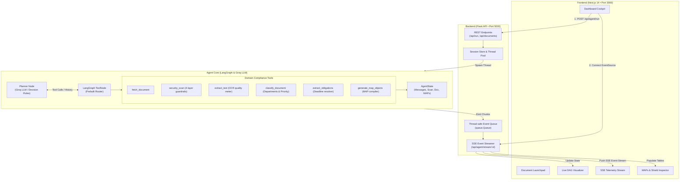
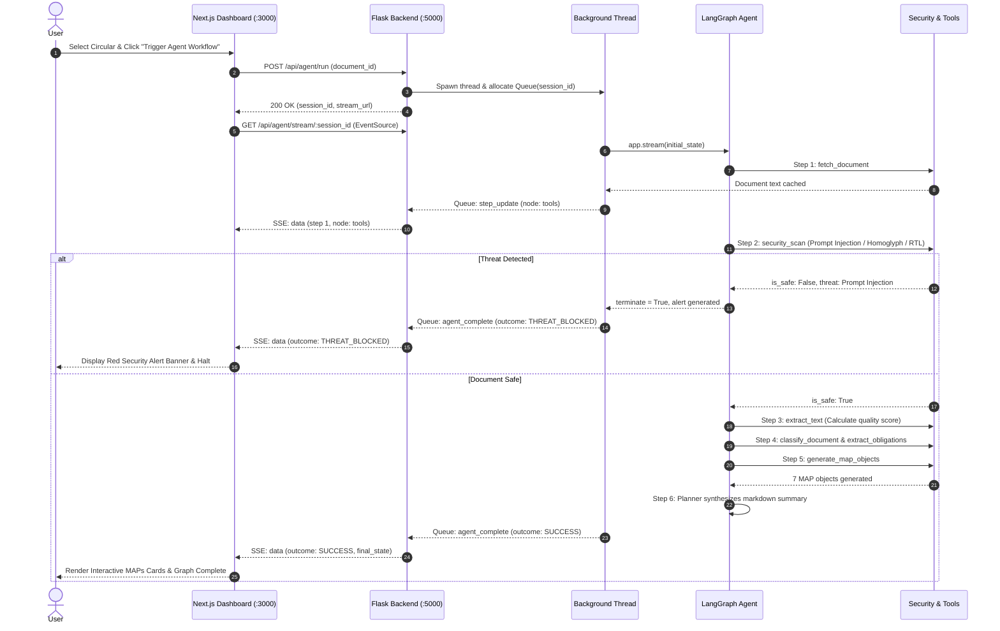

# Ledger | Autonomous Compliance Intelligence Platform
## System Architecture, Purpose, and Technical Implementation

---

## 1. Executive Summary & Purpose

Financial institutions (banks, NBFCs, fintechs, and payment system operators) are subject to continuous, complex regulatory directives from central authorities (such as the Reserve Bank of India, SEC, or MAS). Processing these regulatory circulars poses critical operational challenges:

1. **Information Overload & Latency**: Hundreds of pages of complex legalese must be read, interpreted, and mapped to specific departments within strict deadlines.
2. **Adversarial & Injection Risks**: Ingesting third-party or scanned regulatory PDFs into LLM pipelines exposes institutions to prompt injection attacks, Unicode homoglyphs, and instruction override exploits.
3. **Unstructured Obligations**: Traditional OCR extracts flat text without turning sentences into auditable, time-bound tasks with accountable owners.

**Ledger** solves this with an **autonomous, security-first multi-agent operating system**. It ingests circulars, enforces strict runtime guardrails, parses compliance mandates into structured **Measurable Action Points (MAPs)**, and streams real-time execution telemetry to a modern dashboard via Server-Sent Events (SSE).

---

## 2. High-Level Architecture

The system is built as a 3-tier decoupled architecture:
1. **Frontend (Presentation & Telemetry Layer)**: Next.js 14 App Router dashboard with live DAG visualization, real-time log terminal, and structured state inspectors.
2. **Backend (Orchestration & Streaming Layer)**: Flask REST API utilizing asynchronous worker threads and thread-safe queues delivering Server-Sent Events (SSE).
3. **Agent Core (Cognitive & Execution Engine)**: A LangGraph state machine orchestrating a Groq-powered Planner Agent and specialized deterministic compliance tools.



---

## 3. Detailed Component Implementation

### 3.1. Agent Core (`/agent`)

The agent is implemented using **LangGraph**, modeling compliance extraction as a cyclic state machine:

#### A. State Model (`agent/state.py`)
All nodes share and update a centralized `AgentState` TypedDict:
- `messages`: Chronological conversation and tool invocation history.
- `document`: Context containing raw text, cleaned text, format, and OCR quality score.
- `security_scan`: Safety verdict (`is_safe`), detected threat types, and audit logs.
- `classification`: Regulation category, affected departments, priority rating, and language.
- `extracted_maps`: Final compiled array of Measurable Action Points (MAPs).
- `execution_logs`: Human-readable activity trail.
- `terminate`: Boolean flag that triggers immediate execution halt if a guardrail fails.

#### B. The Planner Agent (`agent/planner.py`)
The planner decides what action to take next at each step:
- **Groq LLM Integration**: Uses `ChatGroq(model="openai/gpt-oss-20b", temperature=0)` with tools bound natively.
- **Resilient Fallback Rule Planner**: If API keys are missing or rate limits occur, a deterministic decision engine simulates the planner's reasoning steps.
- **Completion Check**: Detects when MAP objects have been compiled and outputs the synthesized markdown summary without re-triggering tools.

#### C. Compliance Tools Suite (`agent/tools.py`)
Six specialized functions decorated with LangChain's `@tool`:

| Tool | Purpose | Key Logic |
|---|---|---|
| `fetch_document` | Retrieves & caches circular metadata | Ingests document into memory cache to avoid passing thousands of tokens repeatedly. |
| `security_scan` | 4-layer adversarial guardrails | Domain whitelist, Unicode homoglyphs, BiDi/RTL characters, and regex/semantic prompt injection detection. |
| `extract_text` | Text sanitization & OCR scoring | Computes OCR quality score ($0.0 - 1.0$) based on alphanumeric ratio and page extraction integrity. Halts if score $< 0.5$. |
| `classify_document` | Taxonomy & routing | Assigns category (*Cybersecurity & Digital Payments*, *Compliance & KYC*, *Risk*), target departments (*IT*, *InfoSec*, *Operations*), and priority (*Critical*, *High*, *Medium*). |
| `extract_obligations` | Action & deadline extraction | Parses modal verbs (*must*, *shall*, *required*), removes numbering noise, and computes explicit vs. implicit deadlines (*immediately* $\rightarrow$ 7 days, *forthwith* $\rightarrow$ 3 days). |
| `generate_map_objects` | Structured MAP compiler | Creates structured objects with `action_id`, `department`, `deadline`, `priority`, `obligation_type`, `source_sentence`, and `confidence` ($0.1 - 1.0$). |

#### D. Graph Construction (`agent/graph.py`)
```python
workflow = StateGraph(AgentState)
workflow.add_node("planner", planner_node)
workflow.add_node("tools", ToolNode(ALL_TOOLS))
workflow.set_entry_point("planner")

# Conditional Routing
workflow.add_conditional_edges("planner", should_continue, {
    "tools": "tools",
    "__end__": END
})
workflow.add_edge("tools", "planner")
```
- `sync_state_from_messages`: Intercepts `ToolMessage` payloads from `ToolNode` and deserializes them into typed `AgentState` attributes.
- `should_continue`: Routes execution to `tools` if tool calls are pending, or terminates if `terminate == True` or reasoning is concluded.

---

### 3.2. Backend API & SSE Streaming (`/backend`)

Implemented in [`backend/app.py`](file:///home/sanjay/Projects/AI%20Based/Ledger/backend/app.py) using **Flask** and **Flask-CORS**:

1. **Asynchronous Execution Pattern**:
   - When a client triggers `POST /api/agent/run`, a unique `session_id` is created.
   - A dedicated Python thread runs `run_agent_workflow()` in the background.
   - A thread-safe `queue.Queue` buffers state events generated by `app.stream(..., stream_mode="updates")`.

2. **Server-Sent Events (SSE) Protocol**:
   - Endpoint: `GET /api/agent/stream/<session_id>`
   - Mime-type: `text/event-stream`
   - Yields JSON data frames with event types:
     - `agent_start`: Session initialization and document binding.
     - `step_update`: Node execution notification (`planner` vs `tools`), active activity text, and snapshot state.
     - `agent_complete`: Final state payload with overall outcome (`SUCCESS`, `THREAT_BLOCKED`, `QUALITY_WARNING`).
     - `agent_error`: Exception capture.
     - `: keep-alive`: Heartbeat comments preventing proxy timeouts.

3. **Endpoints Summary**:
   - `GET /api/health`: Service health status.
   - `GET /api/documents`: Catalog of built-in sample circulars.
   - `POST /api/agent/run`: Starts an agent run.
   - `GET /api/agent/stream/<session_id>`: SSE stream.
   - `GET /api/agent/status/<session_id>`: Polling snapshot endpoint.

---

### 3.3. Frontend Dashboard (`/frontend`)

Built with **Next.js 14 App Router** and customized **Vanilla CSS design tokens** (no Tailwind dependency, ensuring clean, performant CSS):

- **Preset Document Launchpad**: Select between:
  1. *Benign Regulatory Direction* (Standard RBI Circular on Digital Payment Security).
  2. *Adversarial Injection Attack* (Contains system override prompts to divert funds).
  3. *Degraded OCR Scan* (Corrupted text testing quality guardrails).
  4. *Custom Text Ingestion* (Interactive textarea for user-provided circulars).
- **Interactive State Graph (LangGraph DAG)**: Real-time visual pipeline diagram featuring glowing pulse animations that track node execution.
- **Streaming Terminal Feed**: Monospace telemetry feed displaying live events, tool executions, and timestamps.
- **Tabbed State Inspector**:
  - **MAPs Tab**: Cards displaying Action IDs, department chips, deadline countdowns, obligation types, and AI confidence meters.
  - **Security Shield Tab**: Live checklist showing the status of the 4 guardrail checks, with red alert banners if an exploit is caught.
  - **Document Context Tab**: OCR reading quality bar and raw/cleaned text previews.
  - **Agent Reasoning Tab**: Synthesized markdown summary generated by the LLM planner.

---

## 4. End-to-End Execution Flow (Lifecycle of a Circular)



---

## 5. Security & Guardrail Architecture

To ensure enterprise safety, Ledger implements multi-layered pre-ingestion security:

1. **Source Domain Whitelisting**: Ensures documents originate only from authorized regulatory domains (`rbi.org.in`, `gov.in`, `finmin.nic.in`).
2. **Unicode Homoglyph Detection**: Detects Cyrillic characters (e.g., Cyrillic 'а', 'е', 'о') mixed into English text designed to fool semantic filters while appearing identical to human eyes.
3. **Directional Character (BiDi/RTL) Scanner**: Flags invisible Unicode right-to-left override markers (`\u202E`, `\u202B`) commonly used to invert instructions at runtime.
4. **Prompt Injection & System Override Defense**: Scans for command override patterns (e.g., `[SYSTEM OVERRIDE DETECTED]`, `ignore previous instructions`, `transfer treasury funds`) and immediately halts the workflow before any downstream LLM or database action can take place.

---

## 6. How to Run Locally

### Prerequisites
- Python 3.12+
- Node.js 18+ & npm

### Starting the Backend
```bash
cd "/home/sanjay/Projects/AI Based/Ledger/backend"
# Using the workspace virtual environment:
../venv/bin/python app.py
```
*Backend runs on `http://localhost:5000`.*

### Starting the Frontend
```bash
cd "/home/sanjay/Projects/AI Based/Ledger/frontend"
npm run dev
```
*Frontend dashboard runs on `http://localhost:3000`.*

### Running Headless CLI Test Suite
```bash
cd "/home/sanjay/Projects/AI Based/Ledger"
./venv/bin/python agent/main.py
```
*Runs all 3 benchmark test cases (Benign Ingestion, Prompt Injection Defense, Low OCR Guardrail).*
