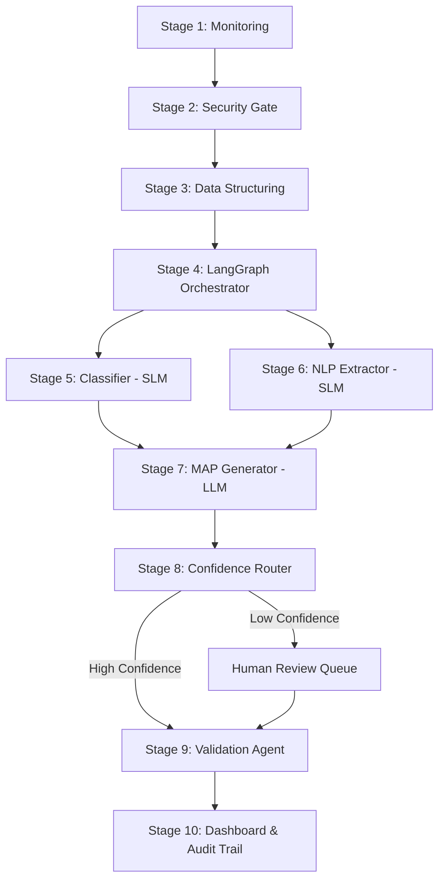

# Ledger: Project Analysis & Implementation Roadmap

Ledger is a **security-first, agentic compliance operating system** designed to automate the entire lifecycle of regulatory compliance for financial institutions (banks, NBFCs, fintechs). It monitors regulatory portals, parses documents safely, extracts actionable compliance mandates into a structured format, routes tasks to the correct departments, and monitors proof of completion.

---

## 1. Ledger in Simple Terms

### The Problem
Financial institutions are constantly flooded with new guidelines, circulars, and notices from multiple regulators (RBI, SEBI, IRDAI, NPCI). Currently, compliance teams must:
1. Manually check websites and download PDFs.
2. Read long, complex legal documents.
3. Guess which department is affected (IT, Finance, HR) and what the deadline is.
4. Assign tasks via spreadsheets or emails.
5. Manually verify if the department actually did the work.

This manual process is slow, inconsistent, hard to audit, and carries a high risk of multi-million dollar penalties if a deadline or rule is missed.

### The Solution: Ledger
Ledger automates this entire pipeline using AI agents:
1. **Automated Monitoring**: It acts as a digital watchman, constantly checking regulatory websites for new documents.
2. **Security Gate**: Before the document touches any AI or internal system, it goes through a strict security check to prevent hacking attempts (like hidden instructions in PDFs).
3. **AI-Powered Reading & Extraction**: A specialized AI reads the document, extracts exact tasks, identifies the affected department, and determines the deadline. It formats these tasks as **Measurable Action Points (MAPs)**.
4. **Confidence-Based Routing**:
   - If the AI is highly confident (>90%), the task is assigned automatically.
   - If the AI is unsure, it puts the task in a queue for a human compliance officer to review and approve.
5. **Automated Verification**: It doesn't just assign tasks; it checks them. It integrates with internal tools (like Jira) and reads uploaded evidence (e.g., policy documents) to verify that the work has actually been completed.
6. **Dashboard**: A real-time hub where executives and auditors can see compliance health scores, pending deadlines, and an immutable history of every action.

---

## 2. Core Concept: Measurable Action Points (MAPs)

The entire system revolves around converting messy regulatory text into a clean database object called a **MAP**. A MAP has a strict structure:

| Field | Description | Example |
| :--- | :--- | :--- |
| `action` | The exact task required. | "Implement 2FA for transactions above Rs. 50,000" |
| `department` | Affected department(s). | `["IT", "Security"]` |
| `deadline` | Normalized date (ISO 8601 format). | `"2025-08-01"` |
| `deadline_type` | How the deadline was found. | `"explicit"`, `"derived"`, or `"implicit"` |
| `priority` | Importance level. | `"Critical"`, `"High"`, `"Medium"`, `"Low"` |
| `obligation_type` | Nature of the rule. | `"REQUIRED"`, `"PROHIBITED"`, `"ADVISORY"` |
| `source_sentence` | The exact quote from the document. | `"All banks must implement two-factor authentication..."` |
| `confidence` | The AI's self-assessment score (0-1). | `0.94` |
| `conditions` | Who/what this applies to. | `"Applies to scheduled commercial banks"` |
| `circular_id` | SHA-256 hash of the PDF. | `"8f92a3c2... (uniquely identifies the document)"` |

---

## 3. The 10-Stage Pipeline Architecture

### Stage 1: Monitoring Agent
- **What it does**: Periodically monitors RSS feeds and scrapes RBI, SEBI, IRDAI, and NPCI websites using `Playwright` and `BeautifulSoup`.
- **Outputs**: A downloaded raw document (PDF/HTML) with its SHA-256 hash.

### Stage 2: Vulnerability & Security Check
- **What it does**: Scans the document before any LLM reads it to block hacking attempts.
  - Verifies the source domain (only accepts official sites).
  - Checks file magic bytes (preventing file extension spoofing).
  - Scans for prompt injection attacks (e.g., hidden text saying *"ignore previous instructions"*), homoglyphs, and malicious scripts.

### Stage 3: Data Structuring
- **What it does**: Converts the raw document into clean text.
  - Digital PDFs use `pdfplumber`.
  - Scanned PDFs go through grayscale rendering (to destroy hidden steganographic payloads) and Tesseract OCR.
  - HTML strips styles, scripts, and invisible components.
- **Quality Check**: Rejects document for manual review if readable words are less than 50% of total words.

### Stage 4: Orchestrator Agent
- **What it does**: A central controller built on **LangGraph**. It manages the flow, executes the classification and extraction in parallel (using `asyncio`), and handles retries with exponential backoff if an API fails.

### Stage 5: Classifier Sub-Agent
- **What it does**: A fast, local **LEGAL-BERT** model that determines the regulatory category (KYC, Cybersecurity, etc.), affected departments, priority, and language. Running locally saves API costs.

### Stage 6: NLP Extraction Sub-Agent
- **What it does**: Uses **spaCy** with a custom Named Entity Recognition (NER) pipeline to pinpoint obligations, deadlines, and conditions.
- **Implicit Deadline Resolver**: Converts vague phrases to dates (e.g., `"immediately"` -> 7 days, `"forthwith"` -> 3 days).

### Stage 7: MAP Generation Sub-Agent
- **What it does**: Combines the outputs of Stage 5 & 6, feeds them to a cheap LLM (**GPT-4o mini** with fallback to **Claude Haiku**) using structured JSON tool-calling.
- **Hallucination Guard**: Uses strict Pydantic models. Rejects and retries if the LLM cannot tie the generated MAP fields back to an exact quoted sentence in the source document.

### Stage 8: Confidence Router
- **What it does**: Checks the AI's confidence score:
  - **Score > 0.90**: Assigns task directly to the department.
  - **Score 0.70 - 0.90**: Assigns task but flags it; Department Head must click approve.
  - **Score < 0.70**: Routes to a Compliance Officer's queue for manual correction.

### Stage 9: Validation Sub-Agent
- **What it does**: Monitors completion of the task.
  - Checks system integrations (e.g., if a Jira ticket is closed).
  - Checks if a policy document matches a specific hash.
  - Uses a lightweight model to semantically inspect uploaded proof (e.g., a screenshot or PDF report) to verify it meets the MAP's requirements.

### Stage 10: Dashboard + Audit Log
- **What it does**: A real-time web portal (React + WebSockets) showing compliance health scores, incident vaults, and an immutable audit trail of every change.

---

## 4. Step-by-Step Implementation Roadmap

To build this prototype systematically, we should break the development into five logical phases:

### Phase 1: Core Processing & Security (Stages 2 & 3)
*Build the pipeline's entry gate. If you can't parse and secure the files, the AI cannot process them.*
1. **Setup Workspace**: Initialize a Python environment with Poetry or Pipenv.
2. **Implement Security Scanner**: Write the file verification, magic-byte checker, and a regex/unicode scanner for prompt injections.
3. **Implement Extraction Engines**:
   - Write the digital PDF parser using `pdfplumber` (ensure layout-aware multi-column handling).
   - Write the HTML cleaner using `BeautifulSoup`.
   - Setup Tesseract OCR for image/scanned PDFs.
4. **Validation Test**: Write unit tests passing both safe PDFs and malicious/spoofed PDFs to ensure the security gate works.

### Phase 2: AI Parsing & Extraction Pipeline (Stages 4, 5, 6 & 7)
*Build the intelligence layer. This converts raw text into structured compliance database records.*
1. **LangGraph Orchestrator**: Write the state management graph that coordinates the extraction steps.
2. **Local NLP Classifiers**:
   - Download and initialize `LEGAL-BERT` (from HuggingFace) and a `spaCy` NER model.
   - Implement the sliding window extractor and the implicit deadline resolver dictionary.
3. **LLM MAP Generator**:
   - Code the LLM connection (OpenAI API / Anthropic API).
   - Define the strict Pydantic models for MAP schema.
   - Implement the validation logic that ensures `source_sentence` actually exists in the source text.
4. **Validation Test**: Run the pipeline on 5 real RBI/SEBI circulars and verify the generated JSON outputs.

### Phase 3: Backend API & Storage (Stages 1, 8 & 9)
*Build the data layer and routing rules.*
1. **Database Setup**: Setup PostgreSQL (for structured MAPs, users, and audit logs) and MongoDB (for raw PDF metadata and source text).
2. **FastAPI Application**:
   - Implement REST endpoints for retrieving MAPs, uploading proofs, and handling user roles (RBAC).
   - Create the confidence router rules (auto-assign vs. human queue).
3. **Validation Engine**: Build hooks to mock Jira API completions and read file uploads.
4. **Monitoring Script**: Build the scheduled crawler using `APScheduler` and a scraper targeting mock portal pages.

### Phase 5: React Dashboard (Stage 10)
*Create the user interface that presents this system beautifully to judges and users.*
1. **Frontend Setup**: Initialize a React app (using Vite, TailwindCSS, and shadcn/ui for premium design).
2. **Role Views**: Build the 4 dashboards:
   - **Admin Dashboard**: Pipeline metrics, security incident log ("Vault Complaints").
   - **Compliance Head**: Human review queue, department compliance health scores.
   - **Department Head**: Active MAP task board, file uploader for proof of completion.
   - **Auditor**: Read-only, paginated immutable audit log showing proof verification history.
3. **WebSocket Integration**: Connect frontend to backend for real-time task updates.

---

## 5. Weaknesses in the Current Plan & How to Fix Them

Before beginning code implementation, we should refine the architectural details to solve the weak points noted in the PDF:

1. **The "No Feedback Loop" Problem**:
   - *Weakness*: If a human corrects a wrong department or deadline in the human review queue, the model doesn't learn from it and will repeat the mistake.
   - *Fix*: Implement a local fine-tuning loop or few-shot RAG memory. Store human corrections in PostgreSQL. During LLM MAP generation, search the database for similar historical circulars and inject the corrections into the prompt as few-shot examples.
2. **Shallow Amendment/Versioning Handling**:
   - *Weakness*: If a new circular modifies an older circular, the system doesn't know which old rules are now defunct.
   - *Fix*: Introduce a RAG step over a Vector Database (ChromaDB). Before generating MAPs, query ChromaDB with the new circular content to check if it refers to previous circulars (e.g., *"In supersession of circular DBOD.No..."*). If yes, flag the older MAPs as "Superceded" or generate a visual diff.
3. **Implicit Deadlines (The weakest link)**:
   - *Weakness*: Vague deadlines like "forthwith" or "immediately" are hard to standardize.
   - *Fix*: Expand the implicit deadline dictionary to use a small NLP classification model that determines context. If the deadline is calculated, store `deadline_type = "derived"` and display the calculation logic clearly in the dashboard (e.g., *"Calculated as 3 days from July 10, 2026"*).
